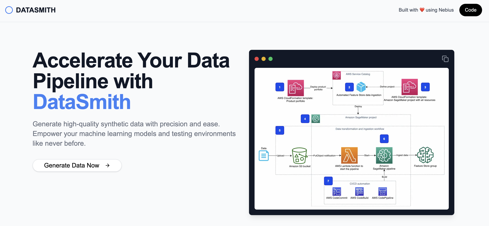

Here’s the updated **README** with the requested changes:

---

# CRAZY CODER 🚀

Built with ❤️ using [Nebius](https://nebius.com/studio/inference?utm_medium=cpc&utm_source=crazyCoder&utm_campaign=Network_en_all_lgen_inference_cloud&utm_term=crazyCoder)

---

**CRAZY CODER** is the hottest new way to write code! With the power of open-source AI models and the simplicity of natural language, you can go from idea to implementation in seconds.

---

## 🌟 Key Features

### 🔥 **The Hottest Programming Language is English**
Write your ideas, pseudo-code, or simple instructions in English, and let the AI do the rest. Forget syntax and debugging headaches—focus on what matters: your creativity.

### ⚡ **Code Fast Now**
No need to learn complex languages or frameworks. Get your program up and running in seconds using powerful open-source AI models like **Qwen**, **Llama**, **Mixtral**, and more.

---

## 🌐 Leverage Open Source

- **Powerful Models**: Utilize cutting-edge coding models like **Qwen-2.5-Coder-32B**, which rivals GPT-4 in performance.
- **Open for All**: These models are available to everyone for rapid prototyping and development.

---

## 🎨 Experiment Freely
Harness the power of the **Nebius AI Studio** to experiment with different models at **low cost**. Create, test, and refine your applications in a flexible environment.

🔗 Learn more about Nebius AI Studio [here](https://nebius.com/studio/inference?utm_medium=cpc&utm_source=crazyCoder&utm_campaign=Network_en_all_lgen_inference_cloud&utm_term=crazyCoder).

---

## 💡 Want to Replicate This App?
The **CRAZY CODER** project is open source!
You can clone the repository and deploy it easily to **Vercel** or your favorite platform.

### 🚀 View the Code on GitHub
- [Clone the repository](#) and start building today!

---

### ✨ Build Your Next Big Idea with CRAZY CODER!
With **Nebius** and cutting-edge open-source models, the possibilities are endless. Start coding smarter, faster, and more creatively than ever before.

---

### 📜 License

This project is licensed under the MIT License.
